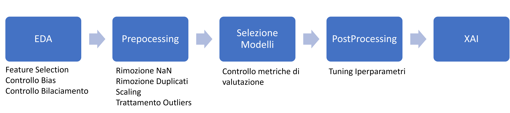

# Thesis: "Clinical Data Management Processes and Predictive Machine Learning Models Development for Diagnosis and Rehabilitation in the Cardiovascular Domain"

## Important Info 📝
This repository contains the LaTeX source files for my Computer Science Thesis, which spans over 100 pages. The research was conducted in collaboration with the multinational company Dedalus, although the source code is not included due to Dedalus' corporate policies.

## Abstract 📜

This thesis focuses on the implementation of three predictive models for the resolution of a binary classification problem, useful for the diagnosis and rehabilitation of patients at risk or affected by cardiovascular diseases. The research was carried out with Dedalus Italia in the context of the REACTS (REspiratory and Cardiac Telerehabilitation integrated home Services) project, with the aim of providing support to centers and hospitals, such as the Maria Cecilia Hospital, and Casa di Cura Sant’Eremo.

The main challenge faced in this study was the acquisition and analysis of high-quality data. Significant attention has been paid to the statistical analysis of available datasets to identify and resolve potential quality issues.

Three models were developed, one for each examined dataset. Using different models, as well as using both clinical and non-clinical data types, allows for a generalization of the result. It is important to keep in mind that the use of the former set of data involves the use of time by medical personnel and financial resources by healthcare institutions. Several algorithms, including Random Forest, XGBoost, Support Vector Machine (SVM), and AdaBoost, were explored during model development, identifying the best-performing configurations through hyperparameter optimization.

Furthermore, Explainable Artificial Intelligence (XAI) has been implemented through the use of techniques such as LIME and Counterfactual Explanations, that make the models interpretable and understandable to us. This not only helped to strengthen confidence in model predictions but also opened the door to possible clinical applications, including the creation of personalized rehabilitation plans based on 5-year increments, developed through the creative use of the AI-generated Counterfactual Explanations.

The results of the study are quite promising: accuracy, precision, and recall, in the two main models, present average values of respectively 95%, 94%, and 95%.

##  Some Pictures,Charts and Results 📷 📈

## Contact 📇

For questions, please feel free to contact me at gb8gb8**AT**gmail**DOT**com 
